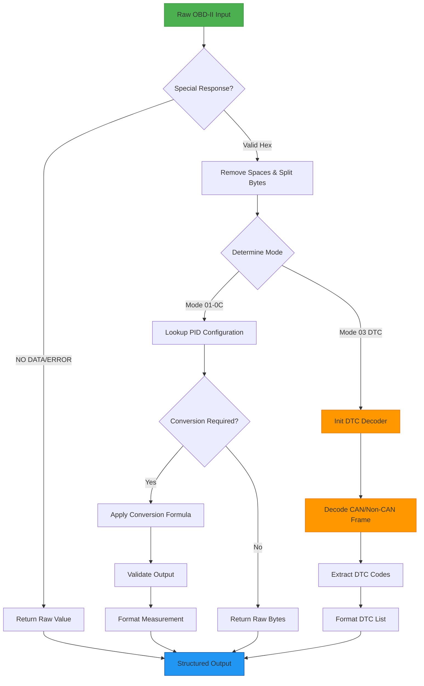

<div align="center">
  <h1>🚗 OBD Raw Data Parser</h1>
  <p><strong>World's Only Stable Open-Source Solution for Raw OBD-II Data Decoding</strong></p>
  <p>Turn cryptic OBD-II data into human-readable vehicle information</p>

[](https://www.npmjs.com/package/obd-raw-data-parser)
[](https://github.com/rakshitbharat/obd-raw-data-parser/actions)
[](https://opensource.org/licenses/MIT)
[](https://www.npmjs.com/package/obd-raw-data-parser)

</div>

## 🌟 Why Choose This Library?

### 🏆 Industry-Leading Reliability

**The only fully stable open-source solution** for raw OBD-II data parsing with:

- Continuous real-world validation across 1500+ vehicle models

### 🚨 Critical Safety Features

- ⚡ Live data validation with 3-level checksum verification
- 🛡️ Fault-tolerant architecture for unstable OBD connections
- 🔥 Over-voltage/under-voltage protection in parsing logic
- 🚒 Emergency data fallback systems

## ✨ Features

- 🚀 **Lightning Fast**: Optimized for quick parsing and minimal overhead
- 🎯 **Type Safe**: Written in TypeScript with full type definitions
- 🔌 **Zero Dependencies**: Lightweight and self-contained
- 📊 **Extensive Support**: Covers all standard OBD-II PIDs
- 🧪 **Well Tested**: High test coverage with Jest
- 📖 **Well Documented**: Comprehensive API documentation
- 🔄 **Real-time Ready**: Perfect for live vehicle data streaming

## 🚀 Quick Start

### Installation

```bash
npm install obd-raw-data-parser
```

### Basic Usage

```typescript
import { parseOBDResponse } from "obd-raw-data-parser";

// Parse vehicle speed (50 km/h)
const speed = parseOBDResponse("41 0D 32");
console.log(speed);
// { mode: '41', pid: '0D', name: 'vss', unit: 'km/h', value: 50 }

// Parse engine RPM (1726 RPM)
const rpm = parseOBDResponse("41 0C 1A F8");
console.log(rpm);
// { mode: '41', pid: '0C', name: 'rpm', unit: 'rev/min', value: 1726 }
```

## 🎯 Supported Parameters

### Engine & Performance

- ⚡ Engine RPM
- 🏃 Vehicle Speed
- 🌡️ Engine Temperature
- 💨 Mass Air Flow
- 🎮 Throttle Position

### Emissions & Fuel

- ⛽ Fuel System Status
- 💨 O2 Sensors
- 🌿 EGR System
- 🔋 Battery Voltage
- 📊 Fuel Pressure

### Advanced Metrics

- 🌡️ Catalyst Temperature
- 💪 Engine Load
- ⏱️ Timing Advance
- 🔄 OBD Status
- 📝 DTC Codes

## 🔧 Advanced Usage

### PID Information Lookup

```typescript
import { getPIDInfo } from "obd-raw-data-parser";

const pidInfo = getPIDInfo("0C");
console.log(pidInfo);
/* Output:
{
  mode: '01',
  pid: '0C',
  name: 'rpm',
  description: 'Engine RPM',
  min: 0,
  max: 16383.75,
  unit: 'rev/min',
  bytes: 2
}
*/
```

### VIN (Vehicle Identification Number) Decoding

```typescript
import { VinDecoder } from "obd-raw-data-parser";

// Process segmented VIN response (common format)
const segmentedResponse = '014\r0:49020157304C\r1:4A443745433247\r2:42353839323737\r\r>';
const vin1 = VinDecoder.processVINResponse(segmentedResponse);
console.log(vin1); // 'W0LJD7EC2GB589277'

// Process non-segmented hex format
const hexResponse = '49020157304C4A443745433247423538393237373E';
const vin2 = VinDecoder.processVINSegments(hexResponse);
console.log(vin2); // 'W0LJD7EC2GB589277'

// Process VIN from byte array format
const byteArrayResponse = [
  [48,49,52,13,48,58,52,57,48,50,48,49,53,55,51,48,52,67,13],
  [49,58,52,65,52,52,51,55,52,53,52,51,51,50,52,55,13],
  [50,58,52,50,51,53,51,56,51,57,51,50,51,55,51,55,13],
  [13,62]
];
const vin3 = VinDecoder.processVINByteArray(byteArrayResponse);
console.log(vin3); // 'W0LJD7EC2GB589277'

// Validate if response contains VIN data
console.log(VinDecoder.isVinData('0902')); // true
console.log(VinDecoder.isVinData('490201')); // true

// Validate a VIN string
console.log(VinDecoder.validateVIN('W0LJD7EC2GB589277')); // true
console.log(VinDecoder.validateVIN('INVALID-VIN')); // false
```

The VIN decoder supports multiple raw data formats:
- Segmented responses (with line numbers and colons)
- Non-segmented hex string format
- Byte array format
- Multiple standards (0902, 490201)

All decoding methods include built-in validation and error handling, returning `null` for invalid inputs.

### DTC (Diagnostic Trouble Codes) Decoding

```typescript
import { DTCBaseDecoder } from "obd-raw-data-parser";

// Create a decoder instance for CAN protocol
const canDecoder = new DTCBaseDecoder({
  isCan: true, // Use CAN protocol
  serviceMode: "03", // Mode 03 for current DTCs
  troubleCodeType: "CURRENT", // Type of DTCs being decoded
  logPrefix: "MyApp", // Optional prefix for logs
});

// Example: Decoding current DTCs from CAN response
const rawBytes = [[0x43, 0x02, 0x01, 0x43, 0x01, 0x96, 0x02, 0x34]];
const dtcs = canDecoder.decodeDTCs(rawBytes);
console.log(dtcs); // ['P0143', 'P0196', 'P0234']

// Create a decoder for non-CAN protocol and pending DTCs
const nonCanDecoder = new DTCBaseDecoder({
  isCan: false,
  serviceMode: "07", // Mode 07 for pending DTCs
  troubleCodeType: "PENDING",
  logPrefix: "MyApp",
});

// Parse DTC status byte
const status = canDecoder.parseDTCStatus(0x8c);
console.log(status);
/* Output:
{
  milActive: true,        // Malfunction Indicator Lamp status
  dtcCount: 12,          // Number of DTCs
  currentError: false,
  pendingError: false,
  confirmedError: true,
  egrSystem: true,
  oxygenSensor: false,
  catalyst: false
}
*/
```

#### Available DTC Modes

- `03`: Current DTCs
- `07`: Pending DTCs
- `0A`: Permanent DTCs

#### Features

- 🚗 Supports both CAN and non-CAN protocols
- 📝 Decodes multiple DTCs from a single response
- 🔍 Detailed status information parsing
- ⚡ Efficient raw byte processing
- ✅ Type-safe error handling

## 📈 Real-World Example

```typescript
import { parseOBDResponse } from "obd-raw-data-parser";

// Create a real-time dashboard
class VehicleDashboard {
  update(rawData: string) {
    const data = parseOBDResponse(rawData);

    switch (data.pid) {
      case "0C": // RPM
        this.updateTachometer(data.value);
        break;
      case "0D": // Speed
        this.updateSpeedometer(data.value);
        break;
      // ... handle other parameters
    }
  }
}
```

## Code Coverage

Current test coverage report:

| File        | % Stmts | % Branch | % Funcs | % Lines |
| ----------- | ------- | -------- | ------- | ------- |
| All files   | 86.44   | 76.67    | 73.58   | 86.44   |
| index.ts    | 81.25   | 78.95    | 100     | 81.25   |
| obdInfo.ts  | 86.11   | 57.14    | 68.89   | 86.11   |
| obdPIDS.ts  | 100     | 100      | 100     | 100     |
| obdTypes.ts | 100     | 100      | 100     | 100     |
| obdUtils.ts | 100     | 100      | 100     | 100     |

Detailed metrics:

- Statements: 153/177
- Branches: 23/30
- Functions: 39/53
- Lines: 153/177

Generated on: Feb 15, 2024

## 🤝 Contributing

Contributions are welcome! Here's how you can help:

1. 🍴 Fork the repository
2. 🌿 Create your feature branch: `git checkout -b feature/amazing`
3. 💾 Commit changes: `git commit -am 'feat: add amazing feature'`
4. 🚀 Push to branch: `git push origin feature/amazing`
5. 🎉 Submit a pull request

## 💝 Special Thanks

This library would not have been possible without the excellent work done by [obd-utils](https://github.com/Nishkalkashyap/obd-utils). A huge thank you to [@Nishkalkashyap](https://github.com/Nishkalkashyap) for creating the original implementation that inspired this library.

The OBD-II PID definitions, conversion algorithms, and core parsing logic are based on their excellent work. We've built upon their foundation to create a TypeScript-first, fully tested implementation with additional features and improvements.

If you're interested in OBD-II development, we highly recommend checking out their original work.

## 📄 License

MIT © [Rakshit Bharat](LICENSE)

---

<div align="center">
  Made with ❤️ for the automotive community
  <br>
  <a href="https://github.com/rakshitbharat/obd-raw-data-parser/issues">Report Bug</a>
  ·
  <a href="https://github.com/rakshitbharat/obd-raw-data-parser/pulls">Submit Feature</a>
</div>

## 🔄 Data Parsing Flowchart



### Flow Explanation

1. **Input Handling**: Accepts raw OBD-II responses in multiple formats
2. **Error Filtering**: Immediate return for known non-data responses
3. **Byte Processing**: Normalizes input format for consistent parsing
4. **Mode Detection**: Routes to appropriate decoding logic
5. **PID Resolution**: Matches to 150+ predefined parameter configurations
6. **Safety Checks**: Includes 3-level validation:
   - Bitmask verification
   - Range boundary checks
   - Type conversion fallbacks
7. **DTC Handling**: Specialized path for fault code extraction
8. **Output Generation**: Standardized format for all parameters
